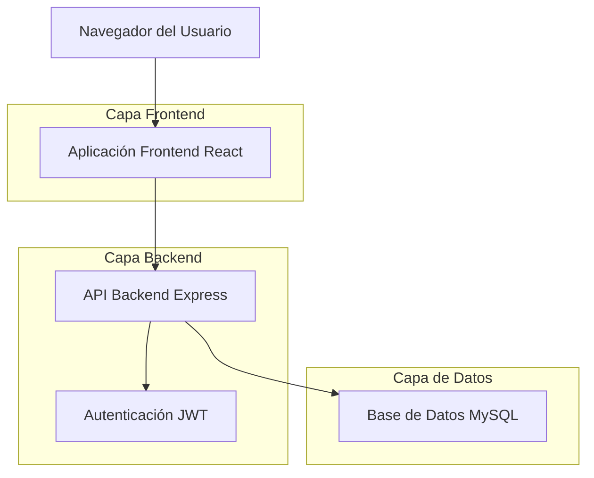
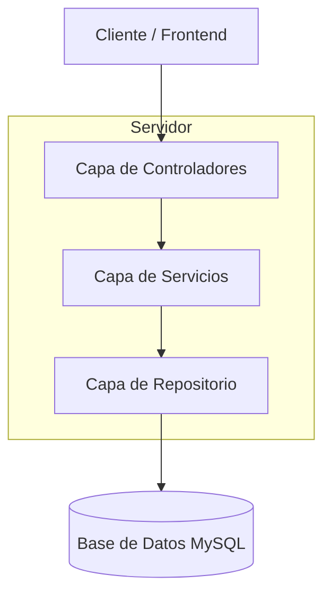
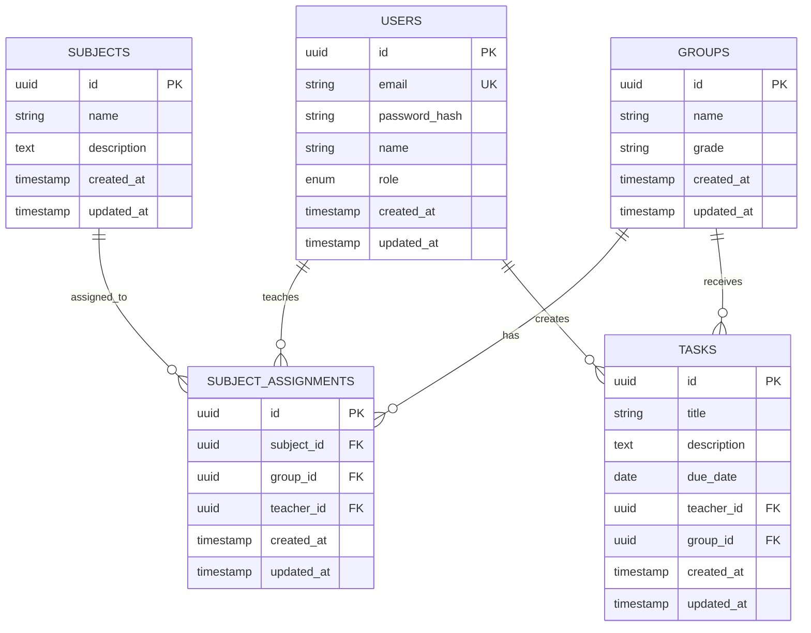

# Sistema de Registro de Tareas para Colegio - Documento de Arquitectura Técnica

## 1. Diseño de Arquitectura



## 2. Descripción de Tecnologías

- Frontend: React@18 + TypeScript + Vite + TailwindCSS + Sonner + SweetAlert2
- Backend: Express@4 + TypeScript + Sequelize + JWT + bcrypt
- Base de Datos: MySQL 8.0

## 3. Definiciones de Rutas

| Ruta | Propósito |
|------|----------|
| / | Página principal, redirige al login si no está autenticado |
| /login | Página de login para autenticación de usuarios |
| /dashboard/coordinator | Dashboard del coordinador con funciones administrativas |
| /dashboard/teacher | Dashboard del profesor con acceso a sus grupos |
| /profile | Página de perfil del usuario (futura implementación) |

## 4. Definiciones de API

### 4.1 API Principal

**Autenticación de usuarios**
```
POST /api/auth/login
```

Request:
| Nombre del Parámetro | Tipo del Parámetro | Es Requerido | Descripción |
|---------------------|-------------------|--------------|-------------|
| email | string | true | Email del usuario |
| password | string | true | Contraseña del usuario |

Response:
| Nombre del Parámetro | Tipo del Parámetro | Descripción |
|---------------------|-------------------|-------------|
| success | boolean | Estado de la respuesta |
| token | string | Token JWT para autenticación |
| user | object | Información del usuario autenticado |

Ejemplo:
```json
{
  "email": "coordinador@colegio.edu",
  "password": "123456"
}
```

**Obtener información del usuario autenticado**
```
GET /api/auth/me
```

Response:
| Nombre del Parámetro | Tipo del Parámetro | Descripción |
|---------------------|-------------------|-------------|
| success | boolean | Estado de la respuesta |
| user | object | Información completa del usuario |

**Obtener datos del dashboard del coordinador**
```
GET /api/dashboard/coordinator
```

Response:
| Nombre del Parámetro | Tipo del Parámetro | Descripción |
|---------------------|-------------------|-------------|
| totalUsers | number | Total de usuarios registrados |
| totalSubjects | number | Total de materias |
| totalGroups | number | Total de grupos |
| recentActivities | array | Actividades recientes del sistema |

**Obtener datos del dashboard del profesor**
```
GET /api/dashboard/teacher
```

Response:
| Nombre del Parámetro | Tipo del Parámetro | Descripción |
|---------------------|-------------------|-------------|
| assignedGroups | array | Grupos asignados al profesor |
| totalTasks | number | Total de tareas creadas |
| subjects | array | Materias que enseña el profesor |

## 5. Diagrama de Arquitectura del Servidor



## 6. Modelo de Datos

### 6.1 Definición del Modelo de Datos



### 6.2 Lenguaje de Definición de Datos

**Tabla de Usuarios (users)**
```sql
-- crear tabla
CREATE TABLE users (
    id CHAR(36) PRIMARY KEY DEFAULT (UUID()),
    email VARCHAR(255) UNIQUE NOT NULL,
    password_hash VARCHAR(255) NOT NULL,
    name VARCHAR(100) NOT NULL,
    role ENUM('coordinator', 'teacher') NOT NULL,
    created_at TIMESTAMP DEFAULT CURRENT_TIMESTAMP,
    updated_at TIMESTAMP DEFAULT CURRENT_TIMESTAMP ON UPDATE CURRENT_TIMESTAMP
);

-- crear índices
CREATE INDEX idx_users_email ON users(email);
CREATE INDEX idx_users_role ON users(role);

-- datos iniciales
INSERT INTO users (email, password_hash, name, role) VALUES
('coordinador@colegio.edu', '$2b$10$hashedpassword', 'Coordinador Principal', 'coordinator'),
('profesor@colegio.edu', '$2b$10$hashedpassword', 'Profesor Ejemplo', 'teacher');
```

**Tabla de Materias (subjects)**
```sql
-- crear tabla
CREATE TABLE subjects (
    id CHAR(36) PRIMARY KEY DEFAULT (UUID()),
    name VARCHAR(100) NOT NULL,
    description TEXT,
    created_at TIMESTAMP DEFAULT CURRENT_TIMESTAMP,
    updated_at TIMESTAMP DEFAULT CURRENT_TIMESTAMP ON UPDATE CURRENT_TIMESTAMP
);

-- crear índices
CREATE INDEX idx_subjects_name ON subjects(name);

-- datos iniciales
INSERT INTO subjects (name, description) VALUES
('Matemáticas', 'Materia de matemáticas básicas y avanzadas'),
('Español', 'Lengua castellana y literatura'),
('Ciencias Naturales', 'Biología, química y física');
```

**Tabla de Grupos (groups)**
```sql
-- crear tabla
CREATE TABLE groups (
    id CHAR(36) PRIMARY KEY DEFAULT (UUID()),
    name VARCHAR(50) NOT NULL,
    grade VARCHAR(10) NOT NULL,
    created_at TIMESTAMP DEFAULT CURRENT_TIMESTAMP,
    updated_at TIMESTAMP DEFAULT CURRENT_TIMESTAMP ON UPDATE CURRENT_TIMESTAMP
);

-- crear índices
CREATE INDEX idx_groups_grade ON groups(grade);
CREATE INDEX idx_groups_name ON groups(name);

-- datos iniciales
INSERT INTO groups (name, grade) VALUES
('11-1', '11'),
('11-2', '11'),
('10-1', '10'),
('10-2', '10');
```

**Tabla de Asignaciones de Materias (subject_assignments)**
```sql
-- crear tabla
CREATE TABLE subject_assignments (
    id CHAR(36) PRIMARY KEY DEFAULT (UUID()),
    subject_id CHAR(36) NOT NULL,
    group_id CHAR(36) NOT NULL,
    teacher_id CHAR(36) NOT NULL,
    created_at TIMESTAMP DEFAULT CURRENT_TIMESTAMP,
    updated_at TIMESTAMP DEFAULT CURRENT_TIMESTAMP ON UPDATE CURRENT_TIMESTAMP,
    FOREIGN KEY (subject_id) REFERENCES subjects(id) ON DELETE CASCADE,
    FOREIGN KEY (group_id) REFERENCES groups(id) ON DELETE CASCADE,
    FOREIGN KEY (teacher_id) REFERENCES users(id) ON DELETE CASCADE,
    UNIQUE KEY unique_subject_group (subject_id, group_id)
);

-- crear índices
CREATE INDEX idx_subject_assignments_teacher ON subject_assignments(teacher_id);
CREATE INDEX idx_subject_assignments_group ON subject_assignments(group_id);
CREATE INDEX idx_subject_assignments_subject ON subject_assignments(subject_id);
```

**Tabla de Tareas (tasks)**
```sql
-- crear tabla
CREATE TABLE tasks (
    id CHAR(36) PRIMARY KEY DEFAULT (UUID()),
    title VARCHAR(200) NOT NULL,
    description TEXT,
    due_date DATE NOT NULL,
    teacher_id CHAR(36) NOT NULL,
    group_id CHAR(36) NOT NULL,
    created_at TIMESTAMP DEFAULT CURRENT_TIMESTAMP,
    updated_at TIMESTAMP DEFAULT CURRENT_TIMESTAMP ON UPDATE CURRENT_TIMESTAMP,
    FOREIGN KEY (teacher_id) REFERENCES users(id) ON DELETE CASCADE,
    FOREIGN KEY (group_id) REFERENCES groups(id) ON DELETE CASCADE
);

-- crear índices
CREATE INDEX idx_tasks_teacher ON tasks(teacher_id);
CREATE INDEX idx_tasks_group ON tasks(group_id);
CREATE INDEX idx_tasks_due_date ON tasks(due_date);
CREATE INDEX idx_tasks_created_at ON tasks(created_at DESC);
```