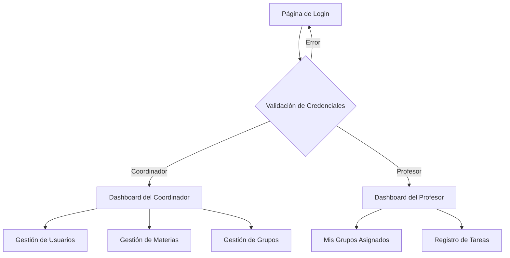

# Sistema de Registro de Tareas para Colegio - Documento de Requerimientos del Producto

## 1. Descripción General del Producto

Sistema web para la gestión y registro de tareas académicas en un colegio, permitiendo a coordinadores y profesores administrar materias, grupos y asignaciones de manera eficiente.

El sistema resuelve la necesidad de centralizar la gestión académica, facilitando la asignación de materias a grupos y el registro de tareas por parte de los profesores.

Objetivo: Digitalizar y optimizar el proceso de gestión académica del colegio, mejorando la organización y seguimiento de las actividades educativas.

## 2. Características Principales

### 2.1 Roles de Usuario

| Rol | Método de Registro | Permisos Principales |
|-----|-------------------|---------------------|
| Coordinador | Registro directo por otro coordinador | Puede registrar usuarios, materias, grupos y asignar materias a grupos |
| Profesor | Registro por coordinador | Puede registrar tareas solo en sus grupos asignados |

### 2.2 Módulo de Características

Nuestro sistema de tareas para colegio consta de las siguientes páginas principales:
1. **Página de Login**: autenticación de usuarios, validación de credenciales, redirección por rol.
2. **Dashboard del Coordinador**: panel de control principal, estadísticas generales, acceso a funciones administrativas.
3. **Dashboard del Profesor**: panel de control del profesor, vista de grupos asignados, acceso a registro de tareas.

### 2.3 Detalles de Páginas

| Nombre de Página | Nombre del Módulo | Descripción de Características |
|------------------|-------------------|--------------------------------|
| Página de Login | Formulario de autenticación | Validar credenciales de usuario, mostrar errores de autenticación, redireccionar según rol del usuario |
| Dashboard del Coordinador | Panel principal | Mostrar estadísticas del sistema, acceso rápido a gestión de usuarios, navegación a módulos de materias y grupos |
| Dashboard del Profesor | Panel del profesor | Mostrar grupos asignados al profesor, acceso a registro de tareas, vista de materias asignadas |

## 3. Proceso Principal

**Flujo de Autenticación y Navegación:**

1. El usuario accede a la página de login e ingresa sus credenciales
2. El sistema valida las credenciales y determina el rol del usuario
3. Si es coordinador, se redirige al dashboard del coordinador con acceso completo a funciones administrativas
4. Si es profesor, se redirige al dashboard del profesor con acceso limitado a sus grupos asignados
5. Desde cada dashboard, el usuario puede navegar a las funcionalidades específicas de su rol

## 4. Diseño de Interfaz de Usuario

### 4.1 Estilo de Diseño

- **Colores primarios:** Azul (#2563eb) y blanco (#ffffff)
- **Colores secundarios:** Gris claro (#f8fafc) y gris oscuro (#1e293b)
- **Estilo de botones:** Redondeados con sombras suaves
- **Fuente:** Inter, tamaños 14px para texto normal, 18px para títulos
- **Estilo de layout:** Diseño de tarjetas con navegación superior
- **Iconos:** Lucide React para consistencia visual

### 4.2 Resumen de Diseño de Páginas

| Nombre de Página | Nombre del Módulo | Elementos de UI |
|------------------|-------------------|----------------|
| Página de Login | Formulario de autenticación | Tarjeta centrada con campos de email y contraseña, botón de login azul, mensajes de error en rojo, fondo degradado |
| Dashboard del Coordinador | Panel principal | Header con navegación, tarjetas de estadísticas, botones de acceso rápido, sidebar con menú de opciones |
| Dashboard del Profesor | Panel del profesor | Header personalizado, lista de grupos en tarjetas, botón flotante para nuevas tareas, vista de materias asignadas |

### 4.3 Responsividad

El sistema está diseñado con enfoque mobile-first, adaptándose a dispositivos móviles, tablets y escritorio. Se optimiza la interacción táctil para dispositivos móviles.